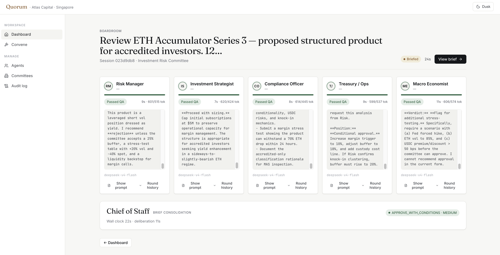

# Quorum

A small, legible multi-agent deliberation engine where every disagreement is preserved and every decision is cryptographically signed.



- Five agents deliberate in parallel on Java 21 virtual threads.
- A Chief-of-Staff agent quality-gates each draft on a 5-axis rubric.
- Drafts get revised or shipped depending on the QA intensity dial.
- The chair's final decision is hashed, chained to prior records, and signed with Ed25519.
- Tamper anywhere — agent text, brief, document, decision — and `quorum verify` rejects the chain.

---

## Requirements

**hardware:** 8 GB RAM, ~4 GB disk. Linux, macOS, or Windows (WSL2). x86_64 or arm64. Backend uses ~1.5 GB heap, frontend dev server ~500 MB, Postgres ~200 MB.

**software:**

| | Version | Notes |
|---|---|---|
| Java | 21 LTS | Temurin, Corretto, Zulu all fine. `sdk install java 21-tem` if you use SDKMAN. |
| Maven | — | Use the bundled `./mvnw` wrapper. No system Maven needed. |
| Node | 20+ | For the frontend. |
| pnpm | latest | `corepack enable && corepack prepare pnpm@latest --activate`. |
| Docker | Desktop or Colima | Postgres is spun up via `docker compose`. Also required for Testcontainers (backend tests). |
| make | any | Drives the top-level `Makefile`. On macOS: `xcode-select --install`. On Linux: ships with `build-essential`. On Windows: use WSL2. |
| DEEPSEEK_API_KEY | env var | `export DEEPSEEK_API_KEY=sk-...` |

Developed and tested primarily on macOS (Apple Silicon). Linux works the same way; Windows requires WSL2.

---

## Quick Start

```bash
export DEEPSEEK_API_KEY=sk-...
make up
open http://localhost:5173
```

From the browser: **Convene committee** → pick a topic → optionally attach a PDF/DOCX → **Start deliberation** → watch the boardroom → read the brief → seal the decision.

A note on the LLM:

- Built and tested against DeepSeek V4.
- The LLM is swappable — anything that speaks the OpenAI-compatible chat API works through Spring AI's `ChatClient`.
- Per-agent overrides are supported, so different agents can run on different models.
- You're welcome to point it at another frontier LLM or a self-hosted model and see how the deliberation changes.

---

## Features in This Version

**Agent setup**

- Type a one-line description (*"skeptical MAS compliance officer"*) and the system generates a structured profile: skills, ideology, biases, boundaries, speaking style.
- Edit any field by hand.
- Personal Wiki — attach curated reference text (regulations, glossaries, prior decisions) that's always prepended to the agent's prompts.
- Per-agent LLM model override is supported.
- Soft-delete + restore preserves audit provenance — agents referenced by sealed sessions can't be hard-deleted.

**Committee setting**

- Build a committee from agents in the library and set speaking order.
- Optionally attach standing doctrine ("knowledge text") that the committee always carries into deliberations.
- Seeded Investment Risk Committee gives you a working 5-persona example out of the box.

**Convene with agenda**

Two-stage flow:

- Stage 1 — pick a committee and type or NL-generate an agenda from a one-line topic.
- Stage 2 — optionally attach up to 5 supporting documents (PDF / DOCX / XLSX / CSV / TXT).
- Document text is injected into every agent's prompt.
- Each document's SHA-256 is folded into the audit envelope.

---

## Patterns

If you came to study how the multi-agent orchestration is done, these are the load-bearing files:

| Pattern | File |
|---|---|
| Parallel deliberation on virtual threads | [`RoundRobinOrchestrator.java`](quorum-api/src/main/java/io/quorum/session/orchestrator/RoundRobinOrchestrator.java) |
| Chief-of-Staff quality gate (5-axis rubric) | [`ChiefOfStaffService.java`](quorum-api/src/main/java/io/quorum/session/cos/ChiefOfStaffService.java) |
| QA intensity dial (`NONE` / `SINGLE` / `DEEP`) | [`QaIntensity.java`](quorum-api/src/main/java/io/quorum/committee/domain/QaIntensity.java) |
| Consolidation that preserves dissent | [`Consolidator.java`](quorum-api/src/main/java/io/quorum/brief/service/Consolidator.java) |
| Ed25519-signed hash chain | [`DecisionSealer.java`](quorum-api/src/main/java/io/quorum/decision/service/DecisionSealer.java) + [`CanonicalPayloadBuilder.java`](quorum-api/src/main/java/io/quorum/audit/service/CanonicalPayloadBuilder.java) |
| SSE streaming UX (no polling) | [`Boardroom.tsx`](quorum-web/src/pages/Boardroom.tsx) |
| Natural language → structured agent profile | [`AgentGenerationService.java`](quorum-api/src/main/java/io/quorum/agent/service/AgentGenerationService.java) |
| Document grounding (PDF/DOCX/XLSX/CSV/TXT via Tika) | [`DocumentExtractor.java`](quorum-api/src/main/java/io/quorum/session/documents/DocumentExtractor.java) |

Prompts are composed from versioned Handlebars templates under `quorum-api/src/main/resources/prompts/`.

---

## Message Flow

In the current Round Robin pattern, agents do not message each other directly. They each receive the same shared context — topic, attached documents, committee doctrine — at the same moment, deliberate in parallel on virtual threads, and produce independent drafts.

Two implicit messages flow during a deliberation:

1. **shared context → all agents** (broadcast, once) — every agent's prompt is composed from the same topic, document extracts, and committee-level doctrine. Agents don't see each other; they see the same world.
2. **CoS critique → agent** (revision loop) — when the 5-axis rubric fails, the Chief of Staff sends the agent a structured challenge naming the failed axes. The agent revises against the critique. This continues up to `max-revision-rounds`, controlled by the [`QaIntensity`](quorum-api/src/main/java/io/quorum/committee/domain/QaIntensity.java) dial.

After deliberation, the [`Consolidator`](quorum-api/src/main/java/io/quorum/brief/service/Consolidator.java) reads all final drafts and produces one Brief, preserving dissent as a first-class section. Speak-in-turn semantics (where agent N sees the drafts of agents 1..N-1) and the Debate pattern (turn-by-turn exchange between agents) are documented in the [`RoundRobinOrchestrator`](quorum-api/src/main/java/io/quorum/session/orchestrator/RoundRobinOrchestrator.java) docstring as a Phase 2 evolution.

---

## Chief of Staff

The Chief of Staff is a separate agent that does not deliberate. Its job is to challenge — never to contribute substantive content to the brief. Think of it as the second opinion every draft has to clear before it counts.

When each agent finishes a draft, the CoS evaluates it on five axes:

- **specificity** — concrete claims, not hand-waving
- **completeness** — actually answers the question put to the agent
- **evidence** — grounded in cited material (regulation, document, prior decision), not asserted
- **boundaries** — stays inside the agent's declared scope
- **ideology fit** — consistent with the agent's declared biases and stance

Each axis gets a 0–5 score. The rubric returns one of four verdicts:

- `PASSED` — ships as-is.
- `PASSED_WITH_NOTE` — ships as-is, with the note attached for the brief.
- `REVISION_REQUESTED` — triggers a structured challenge back to the agent, naming the failed axes and what to address.
- `FAILED` — same as above but more emphatic.

When the verdict is `REVISION_REQUESTED` or `FAILED`, the agent revises against the critique, the CoS re-scores, and the loop continues for up to `max-revision-rounds` — set by the [`QaIntensity`](quorum-api/src/main/java/io/quorum/committee/domain/QaIntensity.java) dial.

Two design choices worth noting:

1. **The CoS uses a reasoning-tier model** (`deepseek-v4-pro` by default; override with `QUORUM_COS_MODEL`). Stricter critique justifies higher token cost on the gate.
2. **The CoS never edits drafts.** It can request changes but cannot write them. Every word in the final brief is traceable to a named agent, not to a faceless critic — which matters for the audit trail.

If the CoS finds nothing to flag (as in the boardroom screenshot above), every tile shows `Passed OK` and the consolidator runs straight through. That is a valid outcome — not a sign the gate is asleep. On contentious topics or with `QaIntensity=DEEP`, revision loops are routine.

Implementation: [`ChiefOfStaffService.java`](quorum-api/src/main/java/io/quorum/session/cos/ChiefOfStaffService.java).

---

## Running the Stack Manually

`make up` runs both in one shell. If you want them in separate terminals:

```bash
# terminal 1 — backend (auto-starts Postgres via docker compose)
cd quorum-api && ./mvnw spring-boot:run

# terminal 2 — frontend
cd quorum-web && pnpm install && pnpm dev
```

---

## Sample Output

A single deliberation produces an agent draft, a CoS rubric, a consolidated brief, and a sealed audit envelope. Excerpts:

**agent draft (Compliance Officer, partial):**

```
MAS 626 paragraph 4.3 requires that any third-party processor handling
customer-identifying data either reside in Singapore or be covered by an
outsourcing risk assessment approved by the Board. The proposed Frankfurt
processor would trigger the latter…
```

**chief-of-staff rubric (one axis of five):**

```json
{
  "axis": "evidence",
  "score": 3,
  "verdict": "PASSED_WITH_NOTE",
  "note": "MAS 626 §4.3 cited correctly; recommend adding the §6.2 reporting timeline for completeness."
}
```

**sealed audit envelope (truncated):**

```json
{
  "sessionId": "f7e0…3c1b",
  "sequence": 12,
  "previousHash": "9c4a…71e0",
  "payloadHash": "2b88…f4d6",
  "signature": "MEUCIQDk…RAo=",
  "publicKeyFingerprint": "SHA256:7d:21:…:af:90"
}
```

**verifying the chain:**

```bash
$ make verify SESSION=./data/audit/session-f7e0...json
✓ chain length: 12 records
✓ all previousHash links match
✓ Ed25519 signature valid (key fingerprint SHA256:7d:21:…:af:90)
```

Modify any field of any record by one byte and the verifier rejects it.

---

## Verifying the Audit Chain

The verifier is a separate CLI from the running app — it only reads the envelope file and the public key.

```bash
make verify SESSION=./data/audit/session-<id>.json
```

The Ed25519 keypair lives in `quorum-api/data/keys/` as PEM. Swap this for KMS-backed signing in production — `LocalKeystoreSigner.java` is the swap point.

---

## Document Grounding

- Up to 5 documents per session (PDF / DOCX / XLSX / CSV / TXT).
- Size limits: 50 KB extracted per doc, 200 KB total.
- Apache Tika extracts the text; the extract is injected into every agent's prompt and the CoS review.
- Each document's SHA-256 is folded into the audit envelope.
- The verifier rejects the chain if any source document changes after sealing.

---

## Schema

Database schema lives in `quorum-api/src/main/resources/db/migration/` as Flyway-versioned migrations (`V001__init.sql` onward). They run automatically on first boot — no manual DB setup needed.

---

## Tech Stack

- **Backend:** Java 21, Spring Boot 3.5, Spring AI 1.0, Spring Data JPA, Flyway, PostgreSQL 16, Apache Tika 3.2, Ed25519 (java.security)
- **Frontend:** React 18, Vite 5, TypeScript 5.6, zustand, react-router-dom
- **LLM:** DeepSeek V4 via Spring AI's OpenAI-compatible client. Per-agent model override supported.
- **Tooling:** Maven wrapper, pnpm, Docker Compose, Testcontainers

---

## Repo Layout

```
quorum-api/   spring boot backend
quorum-web/   react frontend
docs/         readme assets
```

---

## Acknowledgements

Built on [Spring AI](https://docs.spring.io/spring-ai/reference/), [DeepSeek](https://platform.deepseek.com/), [Apache Tika](https://tika.apache.org/), and the React ecosystem. The architectural idea owes a debt to multi-agent research from the last two years; the audit-chain idea owes everything to standard transparency-log designs.

---

## License

[MIT](LICENSE).

---

Jason Low · [github.com/jasonlow](https://github.com/jasonlow)
